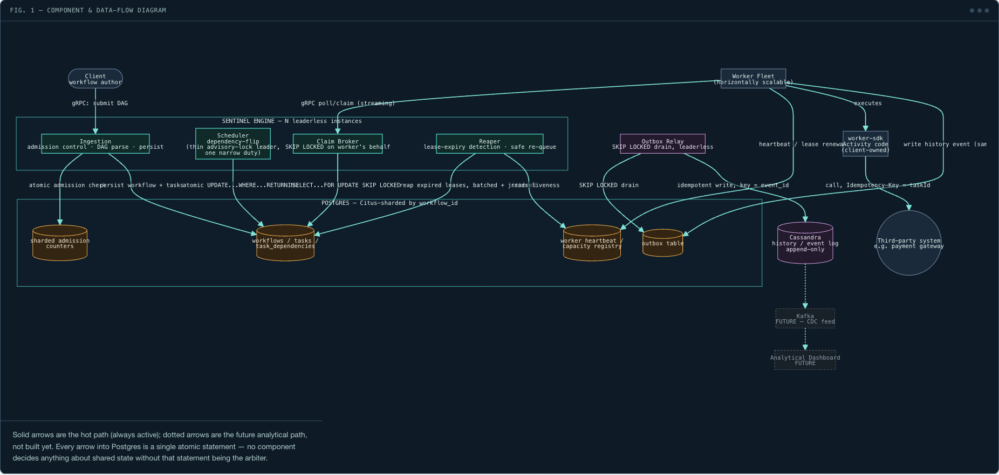
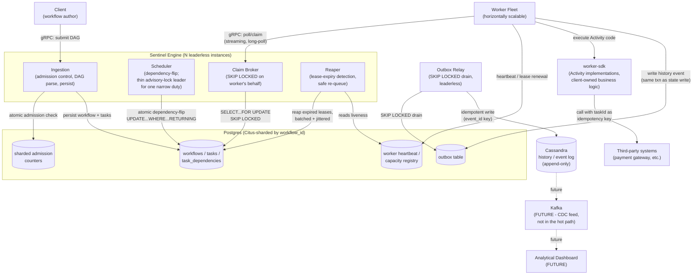
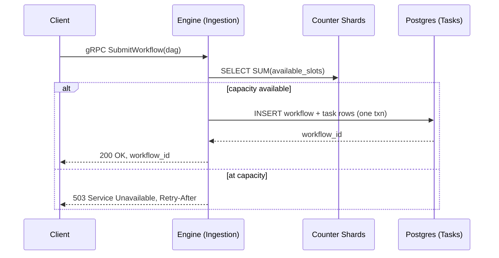
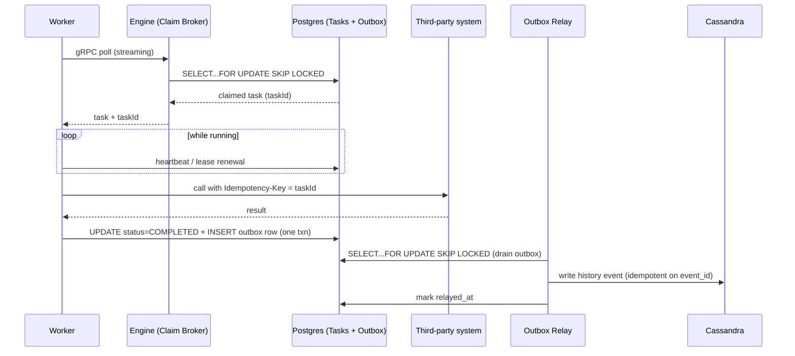
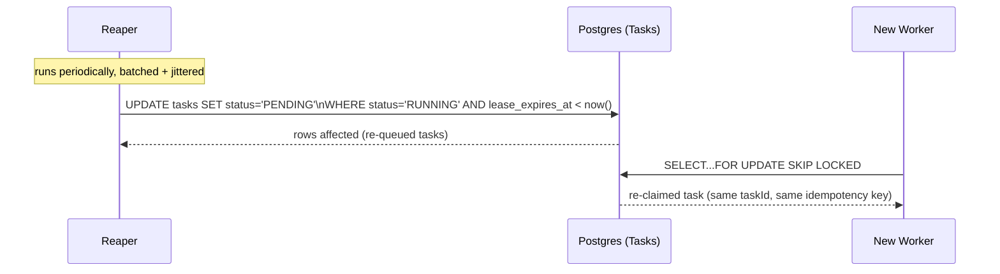

# HLD-001: System Architecture of the Sentinel Engine

- Status: Accepted
- Author: Saurabh Mishra
- Reviewer: Principal Architect (Claude)
- Date: 2026-07-30
- Closes: issue #2
- Companion: `docs/high-level-design/HLD-001-discussion-log.md` (full discussion trail, decisions, and rejected alternatives with reasoning)
- Supersedes: `PRD-001`'s original MVP-only framing, per the scope pivot recorded in the discussion log

## 1. Scope

Sentinel Engine is designed against a 100M-DAGs/day ambition, deliberately comparable to the publicly described scale of Uber's Cadence and Temporal, not a small learning-scale MVP.
The project stays open-ended by design: new technologies are adopted only when they earn their place at this scale, each with a documented reason, not because they are available to try.
This HLD documents the architecture as converged through extended design discussion; see the companion discussion log for the full reasoning trail, including ideas that were proposed and rejected along the way.

## 2. Requirements

### 2.1 Functional Requirements

- FR1: Submit a workflow definition (a DAG of named tasks with dependencies) and receive a workflow id.
- FR2: The engine schedules a task only when all its dependencies are `COMPLETED`.
- FR3: Workers claim tasks such that no task is ever claimed by two live workers at once.
- FR4: Task failures trigger configurable retries with exponential backoff, then mark the task `FAILED`.
- FR5: A `FAILED` task fails the workflow branch deterministically.
- FR6: Tasks held by a worker that stops heartbeating are re-queued within a bounded time.
- FR7: Workflow and task status are queryable at any time.

### 2.2 Non-Functional Requirements

- NFR1 (consistency): CP behavior. If Postgres is unreachable, the engine refuses new work rather than guessing.
- NFR2 (throughput): derived from 100M DAGs/day, modeled per task type rather than a single blended average, since task duration is bimodal.
  Target: **~42,400 mutations/sec sustained average, ~211,800 mutations/sec at 5x peak.**
  This is a persistence-layer design target, not a single-Postgres-primary claim; see Section 3.3 for the partitioning strategy this requires.
- NFR3 (latency): p99 task dispatch latency (dependency satisfied to worker claim) under 500ms at target throughput.
- NFR4 (recovery): stranded tasks re-queued within 3 missed heartbeat intervals.
- NFR5 (durability): an acknowledged workflow submission survives crash of any single component.
- NFR6 (observability): every task execution carries a trace spanning submit, schedule, claim, execute, and complete.

## 3. CAP Position

Sentinel Engine chooses **consistency over availability** for all state transitions.
If Postgres cannot be reached, the engine rejects new work and refuses to guess at task state rather than risk a duplicate or lost execution.
This is a deliberate trade: a temporarily unavailable engine is an acceptable cost, a silently corrupted or double-executed workflow (a payment charged twice, for example) is not.

During a network partition between an engine instance and Postgres, that instance is **inert with respect to correctness**, not merely slow.
Every state-changing action this system takes is a Postgres write; an engine instance that cannot reach Postgres cannot schedule, claim, or complete anything, so a partition produces a liveness gap (work pauses) rather than a correctness gap (work corrupts).
This property depends on one architectural rule holding everywhere: **an engine instance's only externally-visible action is a fenced or atomic Postgres write, never a direct push to a worker or third party before that write commits.**

## 4. Component Architecture

Mermaid source for the diagram above, kept in sync as the design changes:

### 4.1 Client / Workflow Author

Writes the workflow DAG definition (which steps, in what dependency order) and the **Activity implementation** for each task type, using `worker-sdk`.
Sentinel Engine never contains or writes this business logic; the platform/client responsibility boundary is: the engine guarantees a stable `taskId` per task instance, the client's Activity code is responsible for using that `taskId` as (or to derive) an idempotency key when it calls any third-party system.

### 4.2 Sentinel Engine

Runs as **N leaderless, active-active instances** with no single point of coordination for the hot path.
Internally split into four responsibilities, all of which can run on any instance concurrently, none of which requires exclusive ownership except where noted:

- **Ingestion**: receives workflow submissions over gRPC, runs the atomic admission-control check against the sharded counters (Section 4.3), and persists the workflow and its task rows in Postgres. Rejects outright (`503` + `Retry-After`) when at capacity; never accepts and queues without a bound.
- **Scheduler**: evaluates dependency-flip conditions ("all of this task's parents are `COMPLETED`, mark it `PENDING`") as an atomic conditional `UPDATE`. Decomposable per-task, so any instance (or even the worker that just completed the parent task) can safely run this with no coordination. One exception: a single, thin advisory-lock-elected leader owns one narrow coordination duty at 100M-DAGs/day scale (see Section 4.2.1) — everything else in this bullet remains leaderless.
- **Claim Broker**: the gRPC-facing role a worker's poll call actually reaches. Runs `SELECT ... FOR UPDATE SKIP LOCKED` on the worker's behalf and returns a claimed task, or nothing. This is the entire dispatch mechanism — the Postgres tasks table is the queue, there is no broker in this path.
- **Reaper**: periodically finds tasks whose lease has expired (`status = 'RUNNING' AND lease_expires_at < now()`) and atomically re-queues them. Batches and jitters this work rather than requeuing an entire stranded backlog in one burst (see Section 7.2).

#### 4.2.1 Why a thin leader exists at all

Every operation above is leaderless by construction, using atomic conditional Postgres statements instead of exclusive ownership.
The one exception, chosen deliberately over hand-rolled consensus: a **Postgres advisory lock** elects one instance to hold a single narrow coordination duty (kept intentionally undersized in scope, since almost everything else needed no leader at all).
This was chosen over building custom leader election specifically because it reuses a boring, already-correct Postgres primitive instead of adding a new distributed-consensus problem to this system; the project's own separate `redis-from-scratch` project is where consensus is built from scratch, deliberately, so it is not duplicated here.

Trade-offs accepted with this choice (detail in the discussion log):
advisory locks must be held on a dedicated, unpooled connection (pooling can silently lose or double-hold the lock); failover latency depends on connection-death detection and is a liveness cost, not a correctness one, given the boundary rule in Section 3; there is no graceful step-down on a crash, only on clean shutdown.

### 4.3 Postgres (Citus-sharded by `workflow_id`)

The single source of truth for current, claimable state: workflows, tasks, task dependencies, the outbox, the sharded admission-control counters, and worker heartbeat/capacity data.
Sharded via **Citus** (an open-source Postgres extension providing transparent sharding and a distributed query planner), distributed by `workflow_id` so a single workflow's tasks stay co-located and the dependency-flip check never needs to cross shards.
Sharding is confirmed **required**, not optional: benchmarked single-primary Postgres throughput under realistic conditions is ~1,000-1,875 sustained TPS, a 20-200x gap against the NFR2 target depending on average vs. peak.

The admission-control signal is a **sharded counter** (16-32 shard rows, tunable), not a single row and not a live `COUNT` query.
A single counter row would be a hot-row write bottleneck at the claim/complete write rate; a live `COUNT` query gets slower exactly when backlog is largest, the precise moment admission control needs to stay fast.
Each claim decrements a randomly- or hash-selected shard, each completion increments a randomly- or hash-selected shard (no requirement to route back to the same shard, since only the aggregate sum matters), and the read is one `SELECT SUM(...)` statement against one Postgres snapshot.

### 4.4 Worker Fleet

Client-operated, horizontally scalable, polls the Engine's Claim Broker over gRPC (streaming RPC for near-instant wakeup without blind polling).
Executes the client's Activity code, renews its lease via periodic heartbeat writes, and writes a history event into the outbox table in the **same Postgres transaction** as its state-changing write.
Sentinel Engine guarantees **at-least-once** task execution, explicitly not at-most-once: a dead worker's task is always re-queued rather than silently dropped, which is why the idempotency-key mechanism above is required for any task with an external side effect, and why purely internal state mutations (which stay atomic within Postgres alone) achieve exactly-once effect without needing it.

### 4.5 Outbox Relay

A leaderless pool of relay workers draining the outbox table via the same `SKIP LOCKED` primitive used for task claiming — recognizing "many workers draining a shared table of pending items" as the same structural problem, reusing the same fix.
Ships events to Cassandra using `event_id` (or `(workflow_id, sequence_number)`) as an idempotency/clustering key, so a retried relay overwrites rather than duplicates, and so reads come back in correct logical order regardless of what order relay actually shipped them in.
This closes the dual-write consistency gap between Postgres (state) and Cassandra (history): the outbox write is atomic with the state write, the relay is async and can be retried safely.

### 4.6 Cassandra (history / event log)

Append-only workflow/task execution history, partitioned by `workflow_id`, clustered by a per-workflow monotonic `sequence_number` — a Temporal-style replay and audit trail, matching the real precedent this design was benchmarked against.
Chosen via a CQRS-shaped split specifically so history's ever-growing, contention-free write pattern never competes with Postgres's bounded, contention-managed active-task working set.

### 4.7 Kafka and Analytical Dashboard (future, not in the hot path)

Kafka is deliberately **not** used for task dispatch (Section 6 explains why) and is scoped only for a future analytical dashboard fed from Cassandra's history data — a genuine fan-out/multi-consumer justification (a dashboard, and potentially other future consumers), unlike task dispatch which is a single-worker-gets-one-task relationship with no fan-out need.

## 5. Key Sequence Flows

### 5.1 Workflow submission with admission control

### 5.2 Task claim, execution, and completion

### 5.3 Dead worker detection and safe re-queue

## 6. Trade-offs Considered

- **Postgres `SKIP LOCKED` vs. Kafka for task dispatch**: chosen Postgres. Kafka consumption is pull too (not the push it's often assumed to be), so that wasn't the deciding factor; the deciding factor is that Kafka would still need an atomic Postgres-side gate to prevent duplicate production, making Kafka a pass-through layer over a mechanism already sufficient alone, while adding partition-rebalancing and its own zombie-consumer fencing problem.
- **Advisory-lock leader election vs. hand-rolled leader-follower/WAL**: chosen advisory lock. It reuses Postgres's own session-lifecycle guarantee instead of re-implementing what Postgres's own streaming replication already provides at the data layer; the trade-off accepted is the connection-pooling gotcha and non-graceful crash handling (Section 4.2.1).
- **CQRS split (Postgres for state, Cassandra for history) vs. one store for both**: chosen the split. It avoids doubling Postgres's write burden and keeps its working set bounded, at the cost of introducing a dual-write consistency problem, solved with the transactional outbox rather than accepted as a gap.
- **Sharded admission counter vs. single counter row vs. live `COUNT` query**: chosen sharded counter. A single row is a hot-row bottleneck at the claim/complete write rate; a live count gets slower exactly when most needed (backlog large); a sharded counter's read cost stays constant regardless of backlog size.
- **Reject-outright vs. accept-and-queue for backpressure**: chosen reject-outright (`503` + `Retry-After`). Nothing is ever acknowledged, so there is no durability promise to honor or ambiguous accepted-but-stalled state to manage.
- **Citus vs. hand-rolled multi-primary sharding**: chosen Citus. It already solves shard routing and rebalancing, which a manual approach would have to reinvent for a project intended to be maintained long-term.

## 7. Rejected Alternatives

- **Kafka as the primary task queue.** Rejected as the production claim mechanism: doesn't by itself satisfy FR3 under consumer-group rebalances, and still needs the same atomic Postgres gate to prevent duplicate production. Retained only as a documented comparison exercise, and later, a genuinely justified role feeding the analytical dashboard.
- **ZooKeeper for worker-liveness "global config."** Rejected: push-based failure detection creates a split-brain risk — a worker can appear dead to ZooKeeper while still alive and mid-side-effect. Superseded by the pull-based lease/fencing model (engine reaper polls a heartbeat timestamp in Postgres).
- **Check-then-act idempotency table lookup.** Rejected: a read-then-write check across two workers is a TOCTOU race. The underlying idea (track claim state in Postgres) survives, implemented as one atomic conditional statement instead.
- **Application-layer WAL shipping / leader-follower for the engine.** Rejected: this re-describes Postgres's own streaming replication, misapplied to the application layer. Superseded by advisory-lock election for the one coordination duty that genuinely needs it.
- **CDC-to-Cassandra as an admission-control read source.** Rejected: CDC replication is deliberately asynchronous and eventually consistent, which is correct for history but is the opposite of what a real-time, correctness-critical admission decision needs. Atomicity comes from querying the authoritative store (Postgres) directly within one transaction, not from routing through any particular downstream store.

## 8. Failure Modes

### 8.1 Poison task

**Detection**: a task fails repeatedly; failures are classified as retryable (transient: timeout, downstream 5xx) or permanent (validation errors, downstream 4xx-style rejections) at the point of failure.
**Mitigation**: retryable failures get up to 10 attempts with exponential backoff (2, 4, 8, 16, 32s); permanent failures skip straight to dead-letter after the first attempt, since retrying cannot change the outcome. Exhausted retries move the task to a dead-letter table; the workflow's queryable status reflects the failure per FR5/FR7.

### 8.2 Thundering herd

Two distinct sub-cases, deliberately not treated as one problem.

**Dependency fan-out** (many tasks becoming claimable simultaneously): no new mitigation needed — this is exactly what `SKIP LOCKED` is designed for, many claimers concurrently taking different rows with no blocking.

**Mass reconnection** (engine restart, worker fleet reconnecting en masse, reaper finding a large stranded batch): a genuine risk, mitigated with jitter on every relevant timer (reconnect backoff, heartbeat intervals, `Retry-After` values), batched/staggered reaper recovery instead of one giant requeue burst, and a bulkhead/rate-limit on the engine's poll/claim surface.

### 8.3 Cascading failure

**Detection**: Postgres (or a downstream dependency) becomes slow; naive retries from callers add more load, worsening the slowdown.
**Mitigation**, four combined defenses: exponential backoff and jitter applied to every retry loop, not just task-level retries (claim polling, gRPC transport); a circuit breaker on calls to Postgres and downstream dependencies (fail fast after N consecutive failures, cooldown, periodic recovery probe); bounded connection pools (a standing engineering rule in this project, doubling as a cascading-failure brake, not just resource hygiene); and the admission-control mechanism itself, which is a cascading-failure defense applied at the submission boundary.

### 8.4 Split-brain (why it largely can't happen here)

Every leaderless operation uses an atomic conditional Postgres statement rather than exclusive ownership, so there is no scenario where two instances both believe they own the same claim, schedule decision, or admission decision — Postgres's row-level locking is the arbiter, not application-level coordination.
The one place a "leader" exists at all (Section 4.2.1) is protected by the boundary rule in Section 3: its blast radius is confined to a single fenced Postgres write, so a partitioned or stalled leader is inert, not dangerous.

### 8.5 Not yet formally designed

**Clock skew**: heartbeat and lease timing assumes reasonably synchronized clocks across engine and worker processes; not yet analyzed for what happens under significant skew. Deferred, see Section 9.

## 9. Deferred / Major Upgrades Needed Later

Tracked here so they are visible, not lost, and not mistaken for having been decided against.

- **DAG storage as a deliberate SAGA exercise**: introduce MongoDB for DAG storage specifically to practice the SAGA pattern on the submit path (Mongo write + Postgres write + compensating action), once the core claim/schedule loop is proven. Not needed for correctness; Postgres-only is sufficient today.
- **Client-facing log delivery**: a per-workflow execution log, likely S3-backed with its own retention and access control, distinct from the operator-facing structured logs already in scope via NFR6.
- **`CLAUDE.md` Non-Goals reconciliation**: the project's own non-goals (no custom consensus, Postgres as sole coordinator, no multi-language SDKs) predate this scope pivot and should be reconciled with the direction in Section 1.
- **Task cancellation**: a genuine push from engine to a running worker, not solved by the pull-claim model. Not in the original FR list; needed before cancellation is a supported feature.
- **Ingestion-service vs. scheduler-service split**: not structurally required (neither role needs to be a leader), but a deliberate service-decomposition exercise worth doing later for its own learning value.
- **Sharded advisory-lock leadership**: today's design starts with one thin global leader; revisit sharding the leadership role itself only if benchmarking later proves one leader insufficient at full 100M-DAGs/day scale.
- **Verification spike required before LLD-001**: confirm `SELECT ... FOR UPDATE SKIP LOCKED` behavior when fanned out across Citus shards — an explicit, currently unverified knowledge gap.
- **Analytical dashboard and Kafka CDC feed**: build the dashboard sourced from Cassandra's history log via Kafka, as scoped in Section 4.7 — an explicit learning-scope item, not required for the core engine to function.
- **Heartbeat-vs-lease-renewal-frequency tuning**: NFR4's recovery bound constrains how far lease-renewal write frequency can be reduced below raw heartbeat frequency; needs a real tuning pass once benchmarking data exists.
- **Exact tuning parameters**: admission-counter shard count, hashing scheme, and safety-margin threshold; outbox retention window; dead-letter classification rules. All explicitly LLD-level detail, not decided at this layer.
- **Clock skew failure mode**: not yet analyzed (Section 8.5).
- **Cross-project split**: a dedicated HLD/scoping session for `splitwise-app`'s deep Postgres-concurrency learning track, including whether it adopts this project's own three-gate process and its own `CLAUDE.md`.
