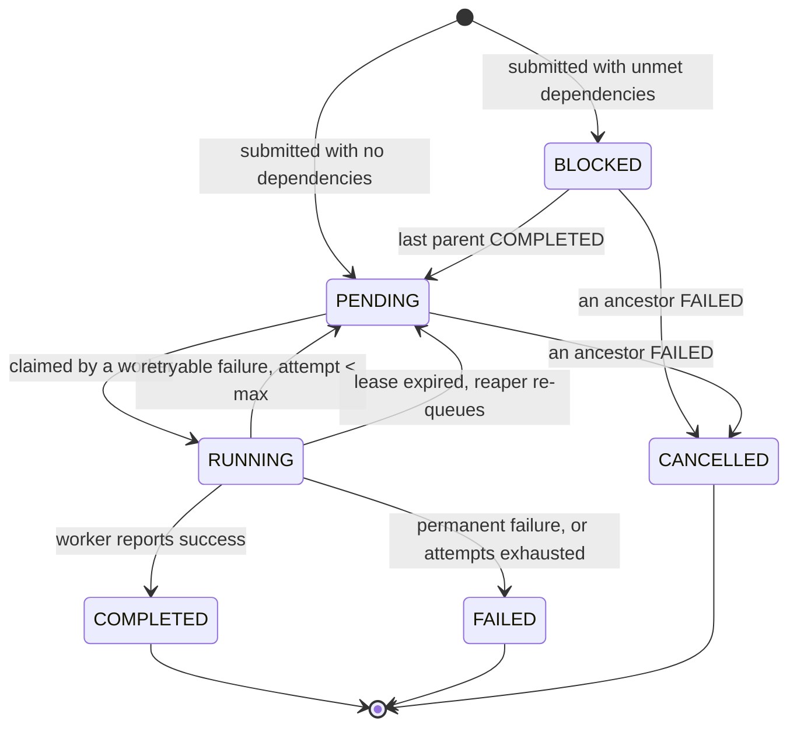
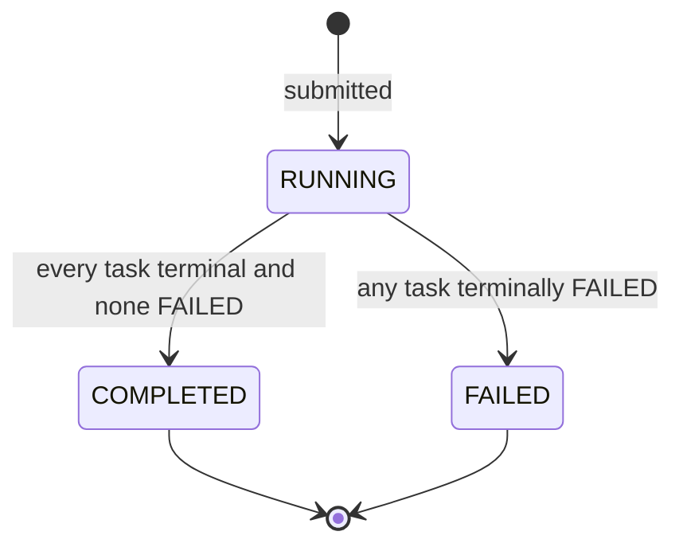
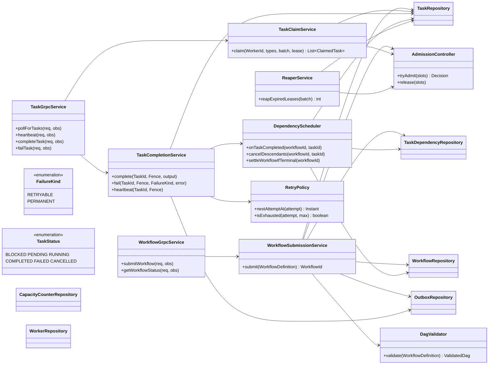

# LLD-001: Database Schema and Postgres-Backed Task Queue

- Status: accepted, amended during implementation of T1.3
- Date: 2026-08-24
- Governs: GitHub issue #3, and the implementation tasks T1.3, T1.4, T1.5, T1.7, T3.3, T3.4
- Implements: HLD-001 (system architecture), PRD-001

## 1. Scope

This document fixes the relational schema, the indexes, every state transition as guarded SQL, the claim query, and the class-level design of the engine's persistence and scheduling core.

It is deliberately scoped to a **single Postgres primary**, not a Citus cluster.
HLD-001 targets 100M DAGs/day and concludes that sharding is required at that scale.
That conclusion is not withdrawn, it is sequenced: the MVP proves the engine loop is correct on one node, and the schema below is shaped so that turning on Citus later is a configuration and migration exercise rather than a redesign.

Section 12 states exactly what that shape-compatibility means and what would break it.

### 1.1 Deferred from this document

- Citus `create_distributed_table` calls and shard rebalancing.
- The Cassandra history store and the outbox relay loop. The `outbox` table is created and written transactionally from day one, so no state-write code has to change when the relay lands. Nothing drains it yet.
- The Redis dispatch-hint index. It exists to convert a multi-shard fan-out into a router query, and a single node has no fan-out to convert.

## 2. Constraints inherited from HLD-001

These are settled upstream and are treated here as requirements, not choices.

- **Postgres is the only source of truth.** Every externally visible engine action is an atomic Postgres write.
- **At-least-once execution.** A dead worker's task is always re-queued, never silently dropped. Exactly-once effect on third parties is the client's responsibility via an idempotency key derived from `task_id`.
- **Leaderless.** Claiming, scheduling, completing, and reaping all run on every engine instance concurrently with no election, because each is a single atomic conditional statement.
- **DAG edges never cross a workflow boundary.** Every workflow is a fully self-contained DAG. This is what makes `workflow_id` a valid distribution key.
- **CP over AP.** If Postgres is unreachable, the engine refuses work rather than guessing.

## 3. Table inventory

| Table | Purpose | Write pattern | Lifetime |
|---|---|---|---|
| `workflows` | One row per submitted DAG execution | Low churn, one insert plus a few status updates | Retained |
| `tasks` | One row per task instance, and the queue itself | Very high churn, several updates per row | Retained, hot subset is small |
| `task_dependencies` | The DAG edges | Insert-only at submission | Retained |
| `outbox` | History events awaiting relay | Insert-only, then one update to mark relayed | Pruned after relay |
| `workers` | Worker liveness and capacity, for observability and capacity accounting | High churn, one update per heartbeat | Pruned |
| `capacity_counters` | Sharded admission-control counter | High churn, tiny fixed row count | Permanent |

Note what is deliberately absent: there is no separate `dead_letter` table and no `task_transitions` history table.
Both are covered in Section 15 (rejected designs).

## 4. DDL

Ships as `engine/src/main/resources/db/migration/V2__core_schema.sql`.
`V1__baseline.sql` is already applied and is never edited.

Postgres 18 is the target (`infra/docker-compose.yml` pins `postgres:18.4`), which gives us `uuidv7()` natively.
UUIDv7 matters here: it is time-ordered, so new rows land at the right edge of the primary-key btree instead of scattering random pages the way UUIDv4 does. On a table taking tens of thousands of inserts per second that is the difference between a compact index and a permanently fragmented one.

```sql
-- ---------------------------------------------------------------------------
-- workflows
-- ---------------------------------------------------------------------------
CREATE TABLE workflows (
    id                  uuid        PRIMARY KEY DEFAULT uuidv7(),
    name                text        NOT NULL,
    status              text        NOT NULL DEFAULT 'RUNNING',
    submission_key      text,
    scheduled_at        timestamptz NOT NULL DEFAULT now(),
    started_at          timestamptz,
    finished_at         timestamptz,
    created_at          timestamptz NOT NULL DEFAULT now(),
    updated_at          timestamptz NOT NULL DEFAULT now(),

    CONSTRAINT workflows_status_check
        CHECK (status IN ('RUNNING', 'COMPLETED', 'FAILED'))
);

-- Client-supplied idempotency for submission: resubmitting the same key
-- returns the existing workflow instead of creating a second execution.
CREATE UNIQUE INDEX workflows_submission_key_uq
    ON workflows (submission_key) WHERE submission_key IS NOT NULL;

-- ---------------------------------------------------------------------------
-- tasks  (this table is also the queue)
-- ---------------------------------------------------------------------------
CREATE TABLE tasks (
    id                       uuid        PRIMARY KEY DEFAULT uuidv7(),
    workflow_id              uuid        NOT NULL REFERENCES workflows (id) ON DELETE CASCADE,
    name                     text        NOT NULL,
    task_type                text        NOT NULL,
    status                   text        NOT NULL,
    input                    jsonb       NOT NULL DEFAULT '{}'::jsonb,
    output                   jsonb,
    last_error               text,
    last_error_kind          text,
    attempt                  int         NOT NULL DEFAULT 0,
    max_attempts             int         NOT NULL DEFAULT 10,
    pending_dependencies     int         NOT NULL DEFAULT 0,
    next_attempt_at          timestamptz NOT NULL DEFAULT now(),
    lease_expires_at         timestamptz,
    owner_worker_id          text,
    fencing_token            bigint      NOT NULL DEFAULT 0,
    created_at               timestamptz NOT NULL DEFAULT now(),
    updated_at               timestamptz NOT NULL DEFAULT now(),

    CONSTRAINT tasks_status_check
        CHECK (status IN ('BLOCKED', 'PENDING', 'RUNNING', 'COMPLETED', 'FAILED', 'CANCELLED')),
    CONSTRAINT tasks_name_uq
        UNIQUE (workflow_id, name),
    CONSTRAINT tasks_attempt_bounds
        CHECK (attempt >= 0 AND attempt <= max_attempts),
    CONSTRAINT tasks_pending_deps_nonneg
        CHECK (pending_dependencies >= 0),
    -- A RUNNING task must have an owner and a lease; a non-RUNNING task must not.
    -- This is the invariant the fencing-token logic depends on, so the database
    -- enforces it rather than trusting every code path to remember.
    CONSTRAINT tasks_lease_consistency CHECK (
        (status = 'RUNNING' AND owner_worker_id IS NOT NULL AND lease_expires_at IS NOT NULL)
        OR
        (status <> 'RUNNING' AND owner_worker_id IS NULL AND lease_expires_at IS NULL)
    )
);

-- The claim index. Its predicate matches the claim query's predicate exactly,
-- so the index contains only rows that are actually claimable right now.
-- Its size tracks queue depth, not table size: a table with 50M completed
-- tasks and 400 pending ones has a 400-entry index here.
CREATE INDEX tasks_claimable_idx
    ON tasks (task_type, next_attempt_at, id)
    WHERE status = 'PENDING';

-- The reaper index. Note what it does NOT contain: lease_expires_at.
-- See Section 6.2 for why leaving it out is the single most important
-- indexing decision in this schema.
CREATE INDEX tasks_running_idx
    ON tasks (id)
    WHERE status = 'RUNNING';

-- Dependency flip and per-workflow status queries.
CREATE INDEX tasks_workflow_status_idx
    ON tasks (workflow_id, status);

-- ---------------------------------------------------------------------------
-- task_dependencies  (the DAG edges)
-- ---------------------------------------------------------------------------
-- workflow_id is denormalised onto this table on purpose. It is redundant
-- relationally (task_id already implies it) but it is the Citus distribution
-- key, and a distributed table must carry its distribution column.
CREATE TABLE task_dependencies (
    workflow_id         uuid NOT NULL REFERENCES workflows (id) ON DELETE CASCADE,
    task_id             uuid NOT NULL REFERENCES tasks (id) ON DELETE CASCADE,
    depends_on_task_id  uuid NOT NULL REFERENCES tasks (id) ON DELETE CASCADE,

    PRIMARY KEY (workflow_id, task_id, depends_on_task_id),
    CONSTRAINT task_dependencies_no_self_edge CHECK (task_id <> depends_on_task_id)
);

-- "Which tasks unblock when this one completes?" - the hot dependency-flip lookup.
CREATE INDEX task_dependencies_parent_idx
    ON task_dependencies (workflow_id, depends_on_task_id);

-- ---------------------------------------------------------------------------
-- outbox  (transactional outbox, written now, relayed later)
-- ---------------------------------------------------------------------------
CREATE TABLE outbox (
    id              uuid        PRIMARY KEY DEFAULT uuidv7(),
    workflow_id     uuid        NOT NULL,
    task_id         uuid,
    event_type      text        NOT NULL,
    payload         jsonb       NOT NULL,
    created_at      timestamptz NOT NULL DEFAULT now(),
    relayed_at      timestamptz
);

-- Partial index over undelivered events only. Once the relay marks a row,
-- it leaves this index, so the index stays proportional to the backlog and
-- not to total history volume.
CREATE INDEX outbox_undelivered_idx
    ON outbox (created_at, id)
    WHERE relayed_at IS NULL;

-- ---------------------------------------------------------------------------
-- workers  (liveness and capacity; NOT the correctness mechanism)
-- ---------------------------------------------------------------------------
-- Task ownership is proven by tasks.fencing_token, never by this table.
-- This table exists for capacity accounting and operator visibility.
CREATE TABLE workers (
    id                  text        PRIMARY KEY,
    task_types          text[]      NOT NULL DEFAULT '{}',
    max_concurrency     int         NOT NULL DEFAULT 1,
    registered_at       timestamptz NOT NULL DEFAULT now(),
    last_heartbeat_at   timestamptz NOT NULL DEFAULT now()
);

CREATE INDEX workers_heartbeat_idx ON workers (last_heartbeat_at);

-- ---------------------------------------------------------------------------
-- capacity_counters  (sharded admission control)
-- ---------------------------------------------------------------------------
-- Admission control needs "how many task slots are free" answered in constant
-- time. A single counter row would be a hot-row bottleneck; a live COUNT(*)
-- over pending tasks gets slower exactly when the backlog is largest, which is
-- precisely when admission control must stay fast. Hence N shard rows summed
-- in one statement.
-- in_flight is deliberately allowed to go negative on an individual shard.
-- See section 11 for why a per-row non-negativity constraint would be wrong.
CREATE TABLE capacity_counters (
    shard_id        int         PRIMARY KEY,
    in_flight       bigint      NOT NULL DEFAULT 0,
    updated_at      timestamptz NOT NULL DEFAULT now()
);

INSERT INTO capacity_counters (shard_id)
SELECT generate_series(0, 15);
```

## 5. State machines

### 5.1 Task



Why `BLOCKED` and `PENDING` are separate statuses rather than one status plus a "are my dependencies met" check: the claim index's predicate is `WHERE status = 'PENDING'`.
If blocked tasks shared that status, every claim would walk index entries for tasks it can never take, and a wide DAG would fill the index with unusable rows.
`PENDING` therefore means exactly one thing throughout this design: **claimable now or at `next_attempt_at`**.

`CANCELLED` exists to satisfy FR5 deterministically.
When a task reaches terminal `FAILED`, everything downstream of it can never run, and leaving those rows `BLOCKED` forever would make them invisible garbage that no query ever cleans up.

### 5.2 Workflow



A workflow has no `PENDING` state.
A scheduled workflow (FR8) is `RUNNING` from submission; the delay lives on its root tasks' `next_attempt_at`, not on the workflow row, because the queue already knows how to not claim a task before its time.

## 6. Indexing rationale

### 6.1 Why the claim index is partial

The claim predicate is `status = 'PENDING' AND next_attempt_at <= now() AND task_type = ANY(...)`.
`tasks_claimable_idx` matches it exactly, which buys two things.

First, size. Postgres only stores index entries for rows satisfying the predicate, so the index is the size of the runnable queue rather than the size of history.

Second, maintenance cost. A row that goes `RUNNING` leaves the index entirely; a completed row was already gone. The index does not accumulate dead entries from finished work.

The cost of a partial index is stated in the task breakdown's edge cases: it rots if the status vocabulary changes.
Adding a status that should be claimable means a new migration with `CREATE INDEX CONCURRENTLY` and a drop of the old one, run outside a transaction, in that order, never a rewrite of `V2`.

### 6.2 Why `lease_expires_at` is deliberately not indexed

This is the most consequential decision in the schema, and it is a direct consequence of how Postgres updates rows.

Postgres never edits a row in place. An update writes a whole new row version, and the old one becomes dead until vacuum removes it.
Postgres has an optimisation for this called a **HOT update** (heap-only tuple): if the update touches no indexed column, the new version can live in the same page and every index entry can keep pointing at the old location. No index writes at all.

Heartbeats are the highest-frequency write in the entire system: every in-flight task gets one every few seconds, forever, for as long as it runs.
A heartbeat writes exactly one column, `lease_expires_at`.
If that column were indexed, every heartbeat would also rewrite index entries, multiplying write amplification and vacuum pressure at the busiest write path we have.

So `tasks_running_idx` indexes only `id`, with the predicate `status = 'RUNNING'`.
The reaper scans that index (whose size is bounded by cluster-wide in-flight concurrency, not by table size) and filters on the heap value of `lease_expires_at`.
That trades a slightly less selective periodic scan for HOT-eligible heartbeats, which is the correct direction by orders of magnitude.

The same logic constrains the reaper's own write: re-queueing does change `status`, so it is not HOT, but the reaper only touches rows that genuinely expired, which is rare.

### 6.3 Left-edge contention

`ORDER BY next_attempt_at` means every claimer converges on the leftmost pages of the same btree.
`SKIP LOCKED` prevents blocking, but the buffer contention on those pages is real once claim concurrency is high.
Mitigation in this design is claim batching: a worker asks for `n` tasks in one round trip, so pressure on the hot page falls by roughly a factor of `n`.
`id` is the last index column so the ordering is total and the plan stays deterministic across ties.

## 7. The claim query

One statement. It selects and takes ownership atomically, so there is no window in which a task is chosen but not yet owned.

```sql
WITH claimable AS (
    SELECT id
      FROM tasks
     WHERE status = 'PENDING'
       AND next_attempt_at <= now()
       AND task_type = ANY(:task_types)
     ORDER BY next_attempt_at, id
     LIMIT :batch_size
     FOR UPDATE SKIP LOCKED
)
UPDATE tasks t
   SET status          = 'RUNNING',
       owner_worker_id = :worker_id,
       fencing_token   = t.fencing_token + 1,
       lease_expires_at = now() + (:lease_seconds * interval '1 second'),
       attempt         = t.attempt + 1,
       updated_at      = now()
  FROM claimable c
 WHERE t.id = c.id
RETURNING t.id, t.workflow_id, t.name, t.task_type, t.input,
          t.attempt, t.max_attempts, t.fencing_token, t.lease_expires_at;
```

### 7.1 Expected plan

`EXPLAIN (ANALYZE, BUFFERS)` on a seeded table should show, for the CTE:

```
Limit
  ->  LockRows
        ->  Index Scan using tasks_claimable_idx on tasks
              Index Cond: (task_type = ANY (...) AND next_attempt_at <= now())
```

Three things are asserted and will be verified by an integration test that runs `EXPLAIN` and fails the build on violation, rather than being claimed in a comment:

1. No `Seq Scan` on `tasks`.
2. No `Sort` node. The index already provides `next_attempt_at, id` order.
3. Rows examined stays proportional to `batch_size`, not to queue depth.

The test matters because a partial index silently stops being used the moment a query's predicate drifts from the index predicate, and that regression is invisible until throughput collapses.

### 7.2 Why `SKIP LOCKED` and not the alternatives

**Advisory locks.** `pg_try_advisory_lock` gives mutual exclusion but no queue semantics: it cannot answer "give me the next available item", so you still need a scan to find a candidate, and you have to hand-manage unlock on every path including crashes. Session-scoped locks also interact badly with connection pooling, where a pooled connection can return to the pool still holding a lock.

**Optimistic version bumping.** `UPDATE ... WHERE id = :id AND version = :v`, retry on zero rows. Correct, but under N concurrent claimers all racing for the same head-of-queue row, N-1 of them lose and retry, and the retry storm gets worse as concurrency rises. `SKIP LOCKED` inverts that: a claimer that finds a row locked walks past it and takes a different one, so throughput scales with concurrency instead of degrading.

**LISTEN/NOTIFY as the dispatch mechanism.** Notifications are not durable and are lost if no session is listening at that instant, so a polling fallback is required anyway, which means building the polling path regardless. It stays available as a latency optimisation later, never as the correctness mechanism.

### 7.3 Claim is not idempotent, and that is intentional

`attempt` increments on claim, not on failure.
This means a task claimed by a worker that then vanishes without ever reporting anything still burns an attempt.
The alternative, incrementing only on reported failure, lets a task that reliably kills its worker be retried forever.
Burning an attempt on claim makes a poison task that crashes workers hit the dead-letter path instead of consuming the fleet indefinitely.

## 8. Fencing tokens

The zombie-worker problem: a worker is alive but stalled (long GC pause, network partition, blocked syscall), its lease expires, the reaper re-queues its task, another worker claims and completes it, and then the first worker wakes up and reports completion for work that is no longer its own.

The fix is that ownership is proven by a number that changes on every claim, not by identity.

`fencing_token` increments on every claim.
The worker receives it and echoes it on every subsequent call.
Every worker-driven write carries it in the `WHERE` clause:

```sql
UPDATE tasks
   SET lease_expires_at = now() + (:lease_seconds * interval '1 second'),
       updated_at = now()
 WHERE id = :task_id
   AND status = 'RUNNING'
   AND owner_worker_id = :worker_id
   AND fencing_token = :fencing_token;
```

Zero rows affected is not an edge case to be logged and ignored, it is the definitive answer "you are a ghost".
Every repository method that runs a guarded update returns the affected row count and the service layer asserts on it. A guarded update whose row count is discarded is a review-blocking defect in this codebase.

The engine responds to a ghost with gRPC `FAILED_PRECONDITION` and the SDK's contract is to abandon the task locally without retrying the report.

## 9. Dependency flip

When a task completes, its children lose one blocker each. Children whose counter reaches zero become claimable.

```sql
-- Step 1: lock the affected children in a deterministic order.
SELECT c.id
  FROM tasks c
  JOIN task_dependencies d ON d.task_id = c.id
 WHERE d.workflow_id = :workflow_id
   AND d.depends_on_task_id = :completed_task_id
 ORDER BY c.id
   FOR UPDATE;

-- Step 2: decrement, and flip the ones that just hit zero.
UPDATE tasks c
   SET pending_dependencies = c.pending_dependencies - 1,
       status = CASE WHEN c.pending_dependencies - 1 = 0 THEN 'PENDING' ELSE c.status END,
       updated_at = now()
 WHERE c.id = ANY(:child_ids)
   AND c.status = 'BLOCKED';
```

### 9.1 Why a counter instead of a join

The alternative is asking, at flip time, "does this child have any parent that is not `COMPLETED`?" with a `NOT EXISTS` subquery.
That is correct and needs no extra column, but its cost scales with the number of parents, and it re-derives on every completion a fact the previous completion already knew.
The counter makes the flip O(children) with no subquery.

The counter's risk is that it can drift if it is ever decremented twice for the same parent.
That cannot happen here because the decrement lives in the same transaction as the guarded update that flips the parent to `COMPLETED`, and that update affects exactly one row exactly once by construction. If it affects zero rows the transaction never reaches the decrement.

### 9.2 Why step 1 exists (deadlock avoidance)

Two parents of overlapping children can complete concurrently on two different engine instances.
Without an ordering rule, transaction A could lock child X then child Y while transaction B locks Y then X, and Postgres resolves that by killing one of them.
Sorting the children by `id` before locking gives every transaction the same acquisition order, so the cycle cannot form.
This is the general rule for the whole codebase: **any statement touching multiple rows of `tasks` locks them in ascending `id` order.**

### 9.3 Workflow completion

Checked in the same transaction as the final task's completion:

```sql
UPDATE workflows w
   SET status = 'COMPLETED', finished_at = now(), updated_at = now()
 WHERE w.id = :workflow_id
   AND w.status = 'RUNNING'
   AND NOT EXISTS (
        SELECT 1 FROM tasks t
         WHERE t.workflow_id = w.id
           AND t.status NOT IN ('COMPLETED', 'FAILED', 'CANCELLED')
   );
```

Two tasks finishing at the same instant may both run this; the `status = 'RUNNING'` guard means exactly one wins and the other affects zero rows, which here is a benign outcome rather than a ghost, and is treated as such.

### 9.4 Failure propagation

When a task reaches terminal `FAILED`, its transitive descendants are cancelled and the workflow fails, in the same transaction, via a recursive walk of `task_dependencies` rooted at the failed task.
The recursion is bounded by the DAG's size, which is bounded at submission time (Section 10.1), so it cannot become unbounded work inside a transaction.

## 10. Submission

### 10.1 Validation, before any write

- The DAG must be non-empty and within a configured maximum task count.
- Task names must be unique within the workflow.
- Every declared dependency must reference a task in the same submission. This is where the "no edge crosses a workflow boundary" rule is enforced, and it is the rule the whole sharding strategy rests on.
- The graph must be acyclic. Detected by Kahn's algorithm, which also yields the initial `pending_dependencies` count per task as a by-product, so cycle detection and counter initialisation are one pass rather than two.

Validation failures are `INVALID_ARGUMENT` and never reach the database.

### 10.2 The submission transaction

One transaction, in this order:

1. Reserve capacity by summing `capacity_counters` and rejecting if the DAG does not fit (Section 11).
2. Insert the `workflows` row, honouring `submission_key` idempotency.
3. Bulk insert `tasks`, each with `status` of `PENDING` when it has no parents and `BLOCKED` otherwise, and `next_attempt_at` set to the requested trigger time for root tasks.
4. Bulk insert `task_dependencies`.
5. Insert one `outbox` row recording `WORKFLOW_SUBMITTED`.

A resubmission of an existing `submission_key` short-circuits at step 2 and returns the existing workflow id, so a client retrying an ambiguous submission cannot create a duplicate execution.

## 11. Admission control

The capacity signal is `configured_total_slots - SUM(in_flight)`.

Read in one statement, never as N per-shard reads summed in application code, since separate round trips would see different snapshots and could produce a torn total:

```sql
SELECT coalesce(sum(in_flight), 0) FROM capacity_counters;
```

Writes pick a shard by `worker_id` hash on claim (increment) and completion (decrement).
There is no requirement to decrement the same shard that was incremented, because only the aggregate matters.
Shard count starts at 16, is configurable, and is a benchmarking target rather than a fixed truth.

Rejection is outright: gRPC `RESOURCE_EXHAUSTED` with a `retry-after-millis` trailer, jittered.
Nothing is ever accepted and silently queued beyond capacity, so NFR5's durability promise applies only to submissions that were actually acknowledged.

The counter is a heuristic, not an invariant.
If it drifts (a crashed engine between claim and counter update), the consequence is admitting slightly too much or too little work, never an incorrect task state. A periodic reconciliation against the real `RUNNING` count corrects drift, and is scheduled work, not hot-path work.

**An individual shard is allowed to go negative, and the clamp lives on the read.**
This was corrected during T1.3, where the first version carried a per-row `CHECK (in_flight >= 0)`.
That constraint quietly contradicts the design.
If a completion may decrement any shard rather than the one its claim incremented, then a shard decremented more often than it has been incremented is a normal, correct state, and only the sum is meaningful.
Clamping each shard at zero silently discards decrements and so inflates the total, which is the opposite of what a clamp is meant to protect against.
The shard rows are therefore unconstrained, and the aggregate read is `GREATEST(0, sum(in_flight))`, which absorbs drift at the one place where a negative answer would be meaningless.

## 12. Citus compatibility

Nothing here calls Citus, but four properties are maintained so that enabling it later is additive.

1. **Every workflow-scoped table carries `workflow_id`**, including `task_dependencies` and `outbox` where it is relationally redundant. A Citus distributed table must contain its distribution column, and adding a column to a large table later is a migration you do not want.
2. **Every primary key and unique constraint on a distributed table includes `workflow_id`**, except `tasks.id`, which is noted in Section 16 as an open item because Citus requires the distribution column in unique constraints.
3. **No query joins across two workflows.** Every read and write above is either scoped to one `workflow_id` or is a queue-wide scan on `tasks` that becomes the multi-shard fan-out HLD-001's Redis hint index exists to eliminate.
4. **`workers` and `capacity_counters` are candidates for Citus reference tables** (small, replicated to every node) rather than distributed tables, since neither is organised around a workflow. HLD-001 left this undecided and it stays undecided here, because on a single node the choice has no effect and making it now would be guessing.

## 13. Class design

Dependencies point inward. `domain` imports nothing from Spring, from JDBC, or from gRPC.



Package layout under `dev.sentinel.engine`:

```
api/grpc      transport only: proto messages in, domain types out, no business rules
domain        records, enums, DagValidator, RetryPolicy - zero framework imports
service       business logic, transaction boundaries, guarded-update assertions
repository    JdbcClient and explicit SQL, no decisions
infra         config, executors, scheduler wiring, clock, metrics
error         the exception taxonomy
```

`RetryPolicy` is a strategy interface, not a switch statement, because retry behaviour is the most likely thing to become per-task-type configurable and the substitution point should exist before it is needed.

Every service takes its collaborators through the constructor. No field injection, no static singletons, no `@Autowired` on fields.

## 14. Threading, transactions, and errors

### 14.1 Threading model

| Thread or pool | Owner | Bound | Rejection or shutdown |
|---|---|---|---|
| gRPC transport threads | Netty event loop, Spring-managed | Fixed, sized to cores | Never runs blocking work |
| `sentinel-grpc-exec-N` | `GrpcServerConfig` | Fixed pool, bounded queue | `AbortPolicy`, surfaced as `RESOURCE_EXHAUSTED` |
| `sentinel-reaper` | `ReaperScheduler` | Single thread, one instance per engine | `shutdownNow` plus awaitTermination on context close |
| Hikari connections | Spring | `maximum-pool-size` strictly greater than concurrent claim handlers | `connection-timeout` 2s, fail fast, never queue forever |

Current `application.yaml` sets the pool to 5, which is a scaffolding default and will be raised alongside the executor sizing when the claim path lands. The rule tying them together is that the request executor must never be able to demand more connections than the pool can provide, or the pool becomes an invisible second queue.

Nothing in the engine holds a lock across IO. Nothing calls `Future.get()` without a deadline.

### 14.2 Transaction boundaries

| Operation | Boundary | Isolation | Notes |
|---|---|---|---|
| Submit | One transaction: admit, workflow, tasks, edges, outbox | READ COMMITTED | Bounded by max DAG size |
| Claim | One statement, one transaction | READ COMMITTED | Milliseconds; no application work inside |
| Heartbeat | Single autocommit statement | READ COMMITTED | Highest frequency path, HOT-eligible |
| Complete or fail | One transaction: guarded update, dependency flip, workflow settle, outbox | READ COMMITTED | Children locked in `id` order |
| Reap | One transaction per batch | READ COMMITTED | Batched and jittered |

READ COMMITTED is sufficient everywhere because no decision is made by reading a value and then acting on it.
Every decision is expressed as a conditional write whose `WHERE` clause re-checks the precondition at write time, which is what makes the whole design free of read-then-write races.

The ack-loss case is explicit: if the engine commits a completion and then dies before the worker learns of it, the worker retries, the guarded update affects zero rows because the task is no longer `RUNNING`, and the SDK treats that as success-already-recorded rather than as a ghost. The distinction between "zero rows because already terminal" and "zero rows because fenced out" is made by reading back the row's current state.

### 14.3 Error taxonomy

| Exception | Meaning | gRPC status |
|---|---|---|
| `InvalidWorkflowException` | Cycle, duplicate name, dangling edge, size limit | `INVALID_ARGUMENT` |
| `WorkflowNotFoundException` | Unknown id | `NOT_FOUND` |
| `AdmissionRejectedException` | At capacity | `RESOURCE_EXHAUSTED` plus retry-after |
| `StaleFencingTokenException` | Caller is a ghost | `FAILED_PRECONDITION` |
| `IllegalTransitionException` | Guarded update matched no row for any other reason | `ABORTED` |
| `PersistenceUnavailableException` | Postgres unreachable, pool exhausted | `UNAVAILABLE` |

Claiming zero tasks is not an error, it is the normal empty case, and is modelled as an empty list rather than an exception.
No `catch` block is empty, and no exception is swallowed to keep a loop alive without a counter and a log line recording it.

## 15. Rejected designs

**One `PENDING` status with a dependency check at claim time.** Rejected: it would put unclaimable rows in the claim index and make the hottest query in the system do work proportional to DAG width.

**A separate `dead_letter` table.** Rejected for the MVP: terminal `FAILED` rows are low-volume and are the same entity, and moving them means a second write path plus a second place to look for a task by id. Revisit if terminal rows measurably bloat the hot table, at which point the right move is partitioning, not a second table.

**A `task_transitions` history table.** Rejected: it duplicates what the outbox already records, and it makes every state change two writes to two high-churn tables. History is the outbox's job, per HLD-001's CQRS split.

**`pending_task_count` on the `workflows` row.** Rejected: it serialises every concurrent completion within one workflow on a single row lock, which is exactly wrong for the fan-out shape workflows are supposed to exploit. The `NOT EXISTS` check costs one index scan on a per-workflow index instead.

**UUIDv4 primary keys.** Rejected: random keys scatter inserts across the whole primary-key btree, which fragments the index and destroys cache locality on the highest-insert table in the system. Postgres 18's `uuidv7()` gives time-ordered ids with no application-side generator.

**`bigserial` primary keys.** Rejected: a global sequence is a coordination point that does not survive the move to Citus, and exposing dense sequential ids to clients leaks execution volume.

**Optimistic locking with a `version` column.** Rejected as the claim mechanism, per Section 7.2, but note the guarded updates throughout this design are the same compare-and-set idea applied where contention is low and a loser has nothing to retry.

## 16. Failure modes

**Mass lease expiry.** A hundred workers die at once, or a network partition heals, and thousands of leases expire in the same second. An unbounded reaper would try to re-queue the whole backlog in one transaction, holding locks across thousands of rows and blocking claims. Mitigation: the reaper takes a bounded batch per pass, sleeps a jittered interval between passes, and uses `SKIP LOCKED` itself so several engine instances reaping simultaneously divide the work instead of colliding.

**Slow-worker false positives under clock skew.** Lease expiry compares `lease_expires_at` against `now()`, and both are Postgres's clock, which is why every timestamp in this schema comes from the database and never from a JVM. The remaining exposure is a worker whose own scheduling is delayed enough to miss heartbeats while still holding a live task. That is not prevented, it is made safe: the task is re-queued and executed again, and the fencing token guarantees the slow worker's eventual write is rejected. At-least-once execution is the accepted cost, and the idempotency key is the client's protection.

**Partial index falls out of use.** A future query whose predicate does not exactly match `WHERE status = 'PENDING'` silently gets a sequential scan, and the symptom is a throughput collapse with no error anywhere. Mitigation: the `EXPLAIN` assertion test in Section 7.1.

**Connection pool exhaustion under claim storms.** Every claiming worker holds a connection for the duration of its claim. If concurrent claim handlers can exceed the pool, claims queue invisibly inside Hikari and latency rises with no metric pointing at the cause. Mitigation: the executor is sized below the pool, `connection-timeout` is short, and pool saturation surfaces as `UNAVAILABLE` rather than as an unbounded wait.

## 17. Open items

1. `tasks.id` is the primary key without `workflow_id`. Citus requires the distribution column in unique constraints, so enabling Citus needs the primary key to become `(workflow_id, id)`. Deliberately deferred: it costs one migration later and would complicate every foreign key now.
2. Shard count for `capacity_counters` is set to 16 by assumption and needs benchmarking.
3. `FOR UPDATE SKIP LOCKED` on a Citus router query remains unverified, carried over from HLD-001 discussion item 12. It does not block this document, since the MVP has one node.
4. Retry backoff uses full jitter over the exponential base, where HLD-001 named a deterministic 2, 4, 8, 16, 32 second sequence. Jitter is added because a deterministic schedule re-synchronises a fleet that failed together. Flagged as a deliberate divergence for review.
