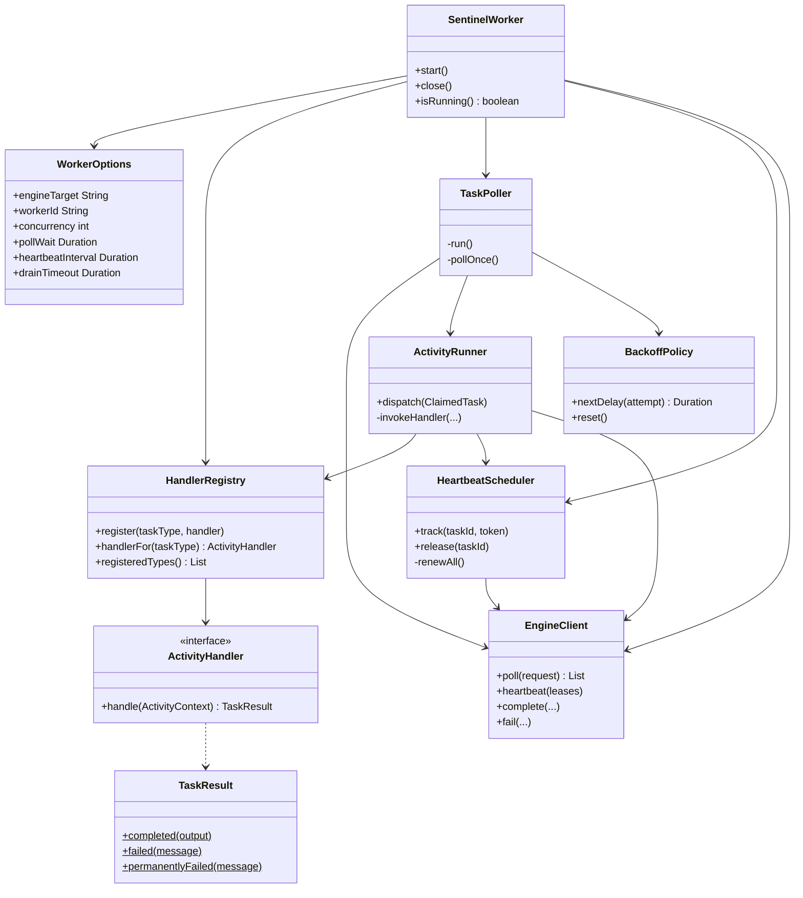

# LLD-002: Worker SDK Design

- Status: proposed
- Date: 2026-08-24
- Governs: GitHub issue #8, and the implementation tasks T2.3 and T2.4
- Implements: HLD-002 (gRPC transport and worker protocol)

## 1. Scope

The class design, threading model, and shutdown semantics of `worker-sdk`, the plain Java library a client uses to run task handlers.

One constraint is fixed by the module itself and is not negotiable here: **the SDK has zero Spring dependency**.
The module's own `pom.xml` says so and says why. A client should be able to run a Sentinel worker inside a Spring app, a Quarkus app, or a bare `main` method, and a library that drags a framework in takes that choice away.

## 2. The public API

The whole surface a user touches:

```java
SentinelWorker worker = SentinelWorker.builder()
        .engineTarget("localhost:9090")
        .workerId("billing-worker-1")           // optional; generated if absent
        .concurrency(8)
        .register("billing.charge", context -> {
            // business logic
            return TaskResult.completed(outputJson);
        })
        .register("billing.refund", new RefundHandler())
        .build();

worker.start();
// ...
worker.close();                                  // AutoCloseable
```

Two interfaces and two value types, and nothing else is public:

- `ActivityHandler`: `TaskResult handle(ActivityContext context) throws Exception`.
- `ActivityContext`: task id, workflow id, task name, attempt number, input, and a cancellation check.
- `TaskResult`: `completed(output)`, `failed(message)`, `permanentlyFailed(message)`.
- `WorkerOptions`: the tuning knobs, built through the builder.

The handler signature declares `throws Exception` on purpose.
Forcing handlers to catch everything themselves produces the worst possible outcome, which is handlers that swallow exceptions to satisfy the compiler. The SDK catches, classifies, and reports.

## 3. Threading model

This is where an SDK is usually wrong, so every thread is named and owned.

| Thread | Count | Owns | Blocking allowed |
|---|---|---|---|
| `sentinel-poller` | 1 | The long-poll loop and dispatch | Yes, that is its job |
| `sentinel-activity-N` | `concurrency` | Running user handler code | Yes, arbitrarily |
| `sentinel-heartbeat` | 1 | Renewing every in-flight lease | Briefly, one RPC |
| gRPC transport | managed by gRPC | The channel | Never blocked by SDK code |

### 3.1 Why the heartbeat thread is separate and dedicated

The tempting simplification is to heartbeat from the poller thread, or from each activity thread for its own task. Both are wrong for the same underlying reason.

If handlers saturate the activity pool with CPU-bound work, an activity thread cannot reliably heartbeat on time. Worse, the failure is silent and self-inflicted: the worker is healthy and working hard, misses its heartbeats *because* it is working hard, gets reaped, and its work is duplicated elsewhere. Load causes the failure that looks like a crash.

A dedicated heartbeat thread doing nothing but one small batched RPC on a timer is the fix. It is also why HLD-002 batches heartbeats: one thread renewing sixteen leases must make one call, not sixteen.

### 3.2 Why the poller does not run handlers

If the poller thread executed a handler, a single slow task would stop the worker from claiming anything else, and a handler that blocks forever would wedge the worker permanently while it still looked alive.
The poller claims and hands off. It never executes.

### 3.3 Capacity is a semaphore, not a queue

The activity executor is bounded with a **zero-length queue**, and the poller acquires a permit before it asks for work.

The reasoning matters more than the mechanism. The obvious design is a bounded executor with a queue: claim eagerly, let tasks wait for a thread. That is exactly wrong here, because a queued task is a *claimed* task, and a claimed task holds a lease it is not making progress on. Queue depth converts directly into lease expiry, re-queue, and duplicate execution.

So the SDK never claims work it cannot start immediately. It asks for exactly as many tasks as it has free permits:

```
availablePermits = concurrency - tasksInFlight
if availablePermits == 0: wait for a completion, do not poll
else: poll for min(availablePermits, maxBatch)
```

The executor's rejection policy is `AbortPolicy`, and it should be unreachable. If it ever fires, the permit accounting is wrong, and a loud failure is the right outcome for that.

## 4. Failure handling in handler code

| What the handler does | What the SDK reports |
|---|---|
| Returns `TaskResult.completed(output)` | `CompleteTask` |
| Returns `TaskResult.failed(message)` | `FailTask`, `RETRYABLE` |
| Returns `TaskResult.permanentlyFailed(message)` | `FailTask`, `PERMANENT` |
| Throws any exception | `FailTask`, `RETRYABLE`, with class and message |
| Throws `Error` (`OutOfMemoryError`, and so on) | `FailTask`, `RETRYABLE`, then rethrow |

An uncaught exception in a handler must never kill the activity thread silently.
A thread that dies quietly takes a permit with it, and a worker configured for eight tasks slowly becomes a worker that runs seven, then six, with nothing in the logs. Every handler invocation is wrapped, and the wrapper is the only place in the SDK allowed to catch `Throwable`.

`Error` is reported and then rethrown, because the process may genuinely be dying and swallowing that would be worse than the task failing.

## 5. Backoff

Two independent backoffs, which are easy to conflate and must not be:

**Transport backoff**, for when the engine is unreachable or returns `UNAVAILABLE`. Exponential from 100ms to 30s, with full jitter.
**Rejection backoff**, for `RESOURCE_EXHAUSTED`, which carries the engine's own retry hint. The SDK honours the hint and jitters around it.

An empty poll is neither of these. It is the normal, expected answer to "is there work?", and the response is to poll again immediately, because the long poll already did the waiting.

Jitter is mandatory on both, and the reason is the stampede in HLD-002 section 11.2: every worker attached to a restarting instance fails at the same instant, so any deterministic backoff has them all return at the same instant too.

## 6. Shutdown

Graceful shutdown is the part of an SDK most likely to be subtly wrong, so the sequence is fixed:

1. **Stop polling.** No new work enters the worker.
2. **Keep heartbeating.** In-flight tasks still hold leases and must keep them.
3. **Wait for in-flight tasks**, up to a configurable drain timeout (default 30s).
4. **For anything still running at the timeout**: stop waiting, let the lease expire naturally.
5. **Stop the heartbeat thread**, then shut down the executor, then close the channel.
6. **Join every thread** with a bounded wait, and log loudly if one refuses to die.

### 6.1 Why step 4 abandons rather than reports failure

The alternative is to report those tasks as failed so they are re-queued immediately, which sounds more helpful and is worse.

A task that has not finished draining is still executing. Reporting it failed while its thread is mid-flight tells the engine the task is available while the worker is still working on it, so another worker starts it *concurrently* rather than afterwards. At-least-once becomes at-least-twice-simultaneously, which is a much harder thing for a client's idempotency key to save them from.

Letting the lease expire costs one lease duration of latency and preserves the invariant that a task is never running in two places at once by the engine's own doing.

Ordering matters as much as the steps: heartbeats stop *after* the drain, not before. Stopping them first would expire the leases of tasks that were about to finish successfully.

## 7. Class design



`EngineClient` is an interface with one gRPC implementation.
Not for ceremony: it is what lets the SDK's threading, backoff and shutdown behaviour be tested against a fake in microseconds, without a server, a port, or a container. Those are the parts most likely to be wrong and hardest to test through a real transport.

## 8. Shared mutable state

Three pieces, each with a stated guard, because unguarded state in an SDK is the bug users cannot debug:

| State | Guard |
|---|---|
| `tasksInFlight` permits | `Semaphore`, released in a `finally` |
| Active leases (task id to fencing token) | `ConcurrentHashMap`, written by activity threads, read by the heartbeat thread |
| `running` flag | `volatile boolean`, written by the shutdown path, read by the poller |

The lease map is the interesting one. It is written by activity threads on dispatch and completion, and read by the heartbeat thread on a timer, so it is genuinely concurrent rather than incidentally so. A `ConcurrentHashMap` is sufficient because the heartbeat thread does not need a consistent snapshot: renewing a lease that was released a millisecond ago is harmless, since the guarded update simply matches nothing.

## 9. Failure modes

**A handler that never returns.** It holds a permit forever, and the worker's usable concurrency drops by one silently. The SDK does not kill handler threads, because interrupting arbitrary user code mid-side-effect is not obviously safer than leaving it running. Instead the drain timeout bounds shutdown, and a metric exposes tasks running longer than a threshold so the condition is at least visible. Documented explicitly as a limitation the client is responsible for: handlers must have their own timeouts.

**Clock-independent lease expiry under a GC pause.** A stop-the-world pause freezes the heartbeat thread along with everything else. If it exceeds the lease, the worker is reaped while perfectly healthy. This is not prevented, it is made safe: the fencing token means the returning worker's writes are rejected, and it learns on its next heartbeat that it no longer owns the task. The lease being three heartbeat intervals is what makes an ordinary pause survivable; an extraordinary one is meant to lose the lease.

## 10. Rejected designs

**A bounded queue in front of the activity executor.** Rejected, per section 3.3: queued work is claimed work holding an unattended lease.

**Heartbeating from activity threads.** Rejected, per section 3.1: it makes heartbeat reliability depend on handler behaviour, and fails precisely under load.

**Killing handler threads on shutdown.** Rejected: interrupting user code mid-side-effect trades a bounded latency cost for an unbounded correctness risk.

**Reporting undrained tasks as failed at shutdown.** Rejected, per section 6.1: it makes the engine start a second copy while the first is still executing.

**A Spring Boot starter for the SDK.** Rejected: the module's own contract forbids a Spring dependency. A starter can live in a separate module later, depending on the SDK rather than being it.
