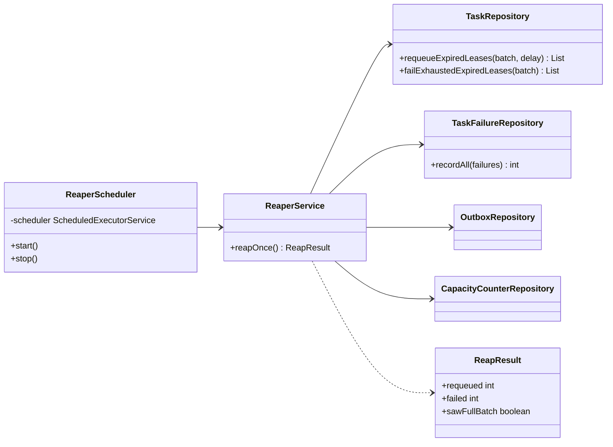

# LLD-003: Retry Policy, Reaper, and Idempotency

- Status: proposed
- Date: 2026-08-25
- Governs: GitHub issue #12, and the implementation tasks T3.3 and T3.4
- Implements: HLD-003 (failure detection and recovery)

## 1. Scope

The classes, schema and queries behind lease recovery, per-task-type retry, and the dead-letter path.

Most of the queue mechanics already exist: `requeueExpiredLeases` and `failExhaustedExpiredLeases` were written in T1.3, and `RetryPolicy` in T1.5.
What is missing is the component that actually calls them on a schedule, per-task-type configuration, and a durable record of why a task failed.

## 2. Schema delta

One new table, shipped as `V3__task_failures.sql`.

```sql
-- Why every attempt failed, in order.
--
-- LLD-001 rejected a general task_transitions table because it duplicated the outbox for every
-- state change. This is narrower and earns its place: it records failures only, its growth is
-- bounded at max_attempts rows per task by construction, and it answers the one question the
-- outbox answers awkwardly, which is "show me this task's failures in order without parsing JSON".
--
-- The bound is the important part. A task that fails instantly in a tight loop writes at most
-- max_attempts rows and then goes terminal, so no failure loop can grow this table without limit.
CREATE TABLE task_failures (
    id            uuid        PRIMARY KEY DEFAULT uuidv7(),
    task_id       uuid        NOT NULL REFERENCES tasks (id) ON DELETE CASCADE,
    workflow_id   uuid        NOT NULL,
    attempt       int         NOT NULL,
    worker_id     text,
    failure_kind  text        NOT NULL,
    error_class   text,
    error_message text        NOT NULL,
    failed_at     timestamptz NOT NULL DEFAULT now(),

    CONSTRAINT task_failures_kind_check
        CHECK (failure_kind IN ('RETRYABLE', 'PERMANENT', 'LEASE_EXPIRED')),
    CONSTRAINT task_failures_attempt_positive CHECK (attempt >= 1),
    -- One row per attempt. A retried report of the same failure must not append a second row,
    -- and the database enforces that rather than the service remembering to check.
    CONSTRAINT task_failures_attempt_uq UNIQUE (task_id, attempt)
);

CREATE INDEX task_failures_task_idx ON task_failures (task_id, attempt);
CREATE INDEX task_failures_workflow_idx ON task_failures (workflow_id, failed_at);
```

`LEASE_EXPIRED` is a third kind alongside the two the worker can report.
It is not a `FailureKind` the SDK can send; it exists so that "nobody ever told us what happened" is visibly different from "the worker told us it failed". Operationally those mean very different things: the first points at worker or network health, the second at the task.

### 2.1 The dead-letter view

```sql
-- Not a table. Terminal failures are already tasks with status = 'FAILED'; a separate dead-letter
-- table would mean a second write path and a second place to look for a task by id, for no gain.
-- A view gives the queryable surface the requirement asks for while keeping one source of truth.
CREATE VIEW dead_letter_tasks AS
SELECT t.id            AS task_id,
       t.workflow_id,
       t.name,
       t.task_type,
       t.attempt,
       t.max_attempts,
       t.last_error,
       t.last_error_kind,
       t.updated_at    AS failed_at,
       w.name          AS workflow_name,
       (SELECT count(*) FROM task_failures f WHERE f.task_id = t.id) AS recorded_failures
  FROM tasks t
  JOIN workflows w ON w.id = t.workflow_id
 WHERE t.status = 'FAILED';
```

## 3. Per-task-type retry configuration

The requirement is that max attempts and the backoff schedule are configurable per task type with sane defaults.

```yaml
sentinel:
  retry:
    base-delay: 2s          # defaults, used by any task type not named below
    max-delay: 5m
    max-attempts: 10
    policies:
      billing.charge:       # a rate-limited payment API: back off harder, give up sooner
        base-delay: 10s
        max-delay: 15m
        max-attempts: 5
      report.render:        # cheap and idempotent: retry fast, try often
        base-delay: 500ms
        max-delay: 30s
        max-attempts: 20
```

Two design points.

**`max_attempts` is resolved at submission and stored on the task row.**
It could be looked up at failure time instead, but then changing configuration would retroactively change the budget of tasks already in flight, and a task could exhaust its attempts because someone edited a YAML file while it was running. Resolving once at submission makes a task's budget a property of the task.

**The backoff schedule is looked up at failure time**, and deliberately not stored.
It is only ever used to compute the next delay, so a configuration change taking effect immediately is what an operator would expect when they lower a delay during an incident.

`RetryPolicy` becomes a lookup rather than a single object:

```java
public interface RetryPolicyResolver {
    RetryPolicy forTaskType(String taskType);   // never null; falls back to the default
}
```

Keeping `RetryPolicy` itself unchanged means the completion service does not learn anything new; it asks the resolver once and uses what it gets.

## 4. The reaper

### 4.1 Class design



`ReaperScheduler` owns the thread and nothing else; `ReaperService` owns one pass and is directly callable, which is what makes the recovery behaviour testable without waiting on a timer.

### 4.2 One pass

Inside a single transaction, and in this order:

1. `failExhaustedExpiredLeases(batch)` first, then `requeueExpiredLeases(batch, delay)`.
2. Record a `LEASE_EXPIRED` row in `task_failures` for every task touched.
3. Append `TASK_LEASE_EXPIRED` outbox events.
4. Release the capacity those tasks were holding.

The ordering in step 1 matters. Re-queueing first would move a task to `PENDING`, at which point the exhausted-attempts query can no longer see it, and a task with no attempts left would be re-queued instead of failed. It would then be claimed, immediately violate `attempt < max_attempts`, and be invisible in the queue forever. Doing the terminal case first means each task is considered by exactly one branch.

### 4.3 Pacing

| Setting | Default | Reason |
|---|---|---|
| `interval` | 5s | Detection latency is dominated by the lease, so this only needs to be well below it |
| `jitter` | ±40% | Several instances must not reap in lockstep |
| `batch-size` | 200 | Bounds transaction size and lock footprint |
| `requeue-delay` | 5s, jittered per task | Stops a recovered batch becoming claimable in one instant |

**The jitter on `requeue-delay` is per task, not per batch.**
A single delay applied to a whole batch just moves the stampede five seconds into the future. Spreading each task across the window is what actually breaks it up, and it is one `random()` call inside the SQL.

When a pass fills its batch, the reaper runs again immediately rather than waiting for the interval, so a large backlog drains in bounded chunks instead of at 200 tasks per five seconds. `ReapResult.sawFullBatch` is what carries that signal.

### 4.4 Threading

| Thread | Owner | Bound | Shutdown |
|---|---|---|---|
| `sentinel-reaper` | `ReaperScheduler` | Single thread, one per engine instance | `shutdownNow` plus bounded `awaitTermination` on context close |

A scheduled task that throws is silently cancelled and never runs again, which here would mean recovery quietly stops for the life of the process with nothing in the logs. The pass is therefore wrapped so that every failure is caught, counted and logged, and the schedule survives.

## 5. Idempotency

No new mechanism, and this section exists to say so explicitly rather than leave a gap where a reader expects one.

The idempotency key is `task_id`, and its guarantee is that it is stable across every attempt of a task, including attempts created by the reaper. The client uses it against external systems; the engine uses the fencing token for its own writes.

Two things worth stating because they are easy to assume wrongly:

- **The engine does not deduplicate side effects**, and cannot. Section 5 of HLD-003 covers why.
- **A re-queued task keeps its id.** It is the same task instance on its next attempt, not a new one, which is exactly what makes the key useful.

## 6. Failure modes

**A reap and a live completion racing on the same row.** A worker finishes at the instant its lease expires. Both paths are guarded updates on the same row: whichever commits first wins, and the loser matches nothing. If the reaper wins, the completing worker is fenced out and its report is rejected, which is correct, because the task has already been given to someone else.

**The reaper falling behind.** If expiries arrive faster than `batch-size / interval`, the backlog grows without bound and recovery latency climbs invisibly. The immediate-rerun-on-full-batch behaviour absorbs bursts, but sustained overload needs to be visible, so a gauge exposes the count of expired-but-unreaped tasks. That number growing is the signal; the reaper itself will not complain.

**A poison task consuming the fleet.** A task that kills its worker never reports, so only the attempt-on-claim rule bounds it. Ten attempts against ten workers is the blast radius, and then the task is terminal. Without incrementing `attempt` at claim time this would be unbounded, which is why that decision is load-bearing rather than a detail.

## 7. Rejected designs

**A separate `dead_letter` table.** Rejected: terminal failures are already `tasks` rows with `status = 'FAILED'`, and moving them means a second write path on the failure path and a second place to look a task up by id. A view gives the same queryable surface over one source of truth.

**Recording failures only in the outbox.** Tempting, since the outbox already carries `TASK_FAILED` events and LLD-001 said history is the outbox's job. Rejected for two reasons: the outbox is pruned after relay, so the cause chain would disappear exactly when someone wants to investigate an old failure, and answering "show me this task's failures in order" would mean parsing JSON payloads. Both events are still written; `task_failures` is the queryable projection.

**A general `task_transitions` table.** Still rejected, for the reason LLD-001 gave. `task_failures` is narrower, bounded by `max_attempts` per task, and answers a question nothing else answers.

**Storing the backoff schedule on the task row.** Rejected: it would freeze the schedule at submission time, so lowering a delay during an incident would not affect the tasks currently failing, which is precisely when an operator wants it to.

**An adaptive reaper interval based on queue depth.** Deferred, not rejected outright. Fixed jittered pacing is predictable and easy to reason about; adaptive pacing introduces a feedback loop that can oscillate, and it should be added with a metric proving it is needed.
